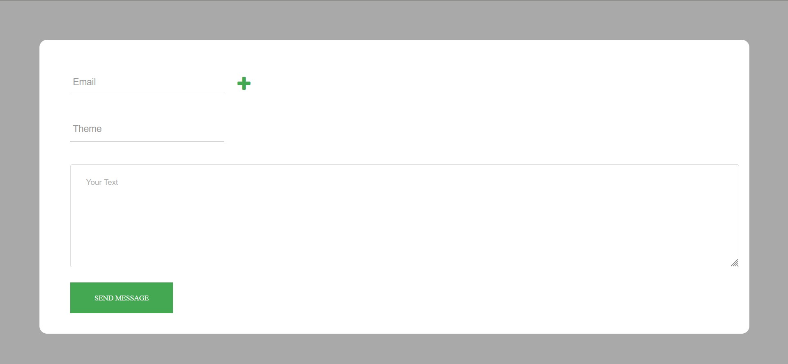
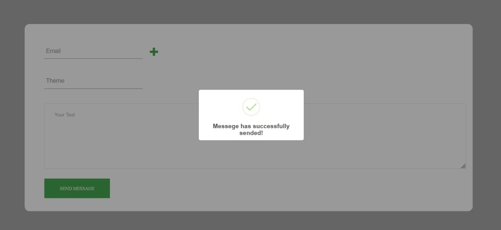
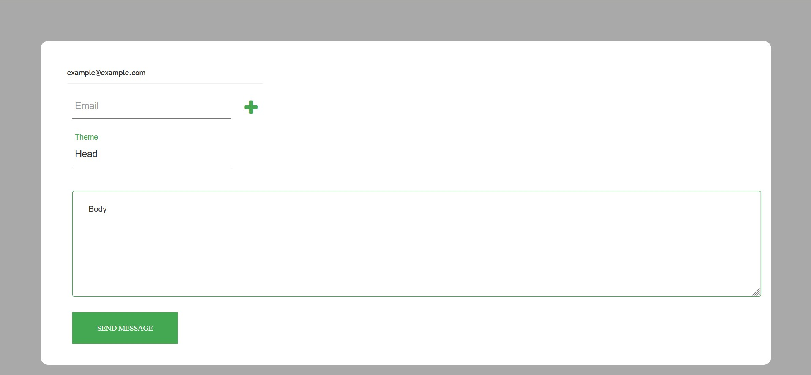

# emailsender  Django Project

<h2>Sending email project</h2>

Links:
- https://docs.djangoproject.com/en/4.0/topics/email/
- https://djangodoc.ru/3.2/topics/email/
- https://stackoverflow.com/questions/6367014/how-to-send-email-via-django
- https://sweetalert2.github.io/

While Python provides an interface for sending mail via the smtplib module, Django provides a couple of lightweight wrappers over it. These wrappers are designed to speed up email sending, to help test email sending during development, and to provide support for platforms that cannot use SMTP.

    Create a project: django-admin.py startproject gmail

    Edit settings.py with code below:

    EMAIL_BACKEND = 'django.core.mail.backends.smtp.EmailBackend'
    EMAIL_USE_TLS = True
    EMAIL_HOST = 'smtp.gmail.com'
    EMAIL_HOST_USER = 'youremail@gmail.com'
    EMAIL_HOST_PASSWORD = 'email_password'
    EMAIL_PORT = 587

    Run interactive mode: python manage.py shell

    Import the EmailMessage module:

    from django.core.mail import EmailMessage

    Send the email:

    email = EmailMessage('Subject', 'Body', to=['your@email.com'])
    email.send()

For more informations, check send_mail and EmailMessage features in documents.

